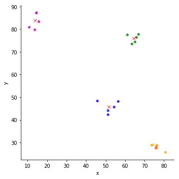

# K-Means Clustering

[](https://travis-ci.org/gbroques/k-means)
[](https://coveralls.io/github/gbroques/k-means?branch=master)

A k-means clustering implementation in Python.

API inspired by Scikit-learn.

**Reference:**  *Introduction to Data Mining* (1st Edition) by Pang-Ning Tan
Section 8.2, Page 496

## Usage


```python
from typing import List

from dataviz import generate_clusters
from dataviz import plot_clusters
from kmeans import KMeans

def generate_data(num_clusters: int, seed=None) -> List[List]:
    num_points = 20
    spread = 7
    bounds = (1, 100)
    return generate_clusters(num_clusters, num_points, spread, bounds, bounds, seed)

num_clusters = 4
clusters = generate_data(num_clusters, seed=1)
k_means = KMeans(num_clusters=num_clusters, seed=4235)
k_means.fit(clusters)
plot_clusters(clusters, k_means.labels_, k_means.centroids_)
```





```python
print('Total Sum of Squared Error (SSE): {}'.format(k_means.inertia_))
```

    Total Sum of Squared Error (SSE): 230.0880894560679

